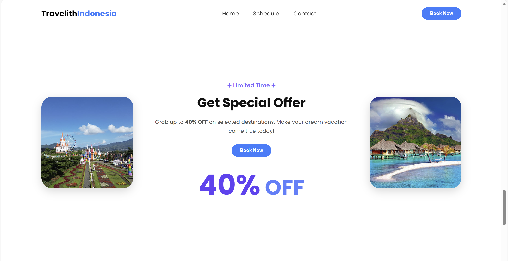

# website-jual-beli-AnggunIsmiN
**Travelith Indonesia** adalah **website pariwisata interaktif** yang menampilkan berbagai **destinasi wisata, jadwal perjalanan, serta form pemesanan** yang mudah digunakan. Aplikasi ini dibangun menggunakan **HTML, CSS, dan JavaScript** untuk memberikan pengalaman eksplorasi wisata yang menarik, responsif, dan dinamis bagi pengguna.

## Deskripsi Singkat
Travelith Indonesia dirancang sebagai aplikasi layanan wisata digital berbasis web yang mengintegrasikan fitur:
- Menjelajahi berbagai destinasi wisata dengan filter “Populer”, “Viral”, dan “Hidden Gems”.
- Sistem filter jadwal wisata berdasarkan kategori, tanggal, dan pencarian nama.  
- Form pemesanan interaktif dengan ringkasan otomatis dan konfirmasi pemesanan.
- Mengirimkan **pesan dan pertanyaan** melalui halaman kontak yang terhubung langsung ke sistem.
- Tampilan website modern dengan animasi scroll, warna gradasi biru–ungu, serta desain responsive.

## Screenshot Tampilan

  
  

  
  

  
  

  
  

  
  

  

## Fitur Utama
- **Halaman Utama (Home):** Menampilkan hero section, destinasi populer, dan promo wisata.  
- **Halaman Schedule:** Fitur filter jadwal wisata berdasarkan kategori, tanggal, dan pencarian.  
- **Halaman Contact:** Formulir kontak dengan tampilan modern dan gradasi biru–ungu.  
- **Halaman Booking:** Form booking interaktif dengan ringkasan otomatis dan modal konfirmasi.

## Video
[Klik di sini](https://youtu.be/VxAf4lGML0Q?si=efVnRnFPJeaSHCX_)
---

## Teknologi yang Digunakan
- HTML
- CSS 
- JavaScript

Anggun Ismi N | 24051204039 | TIB24
