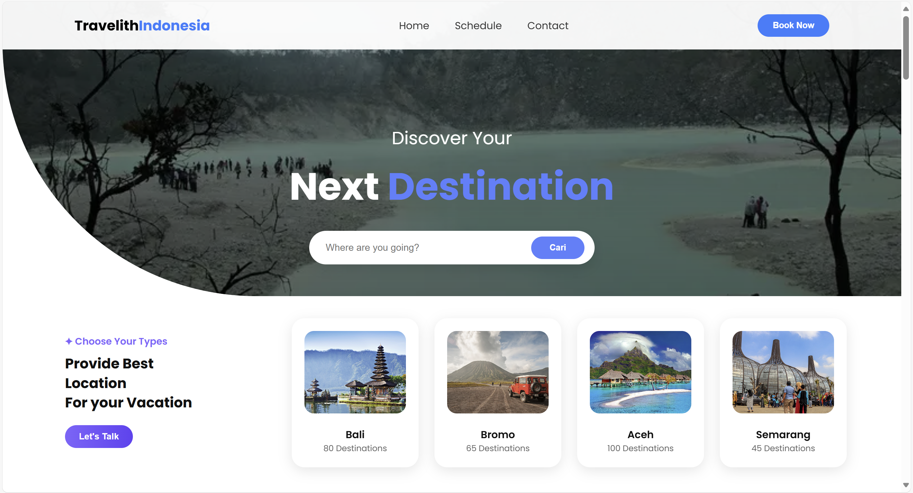
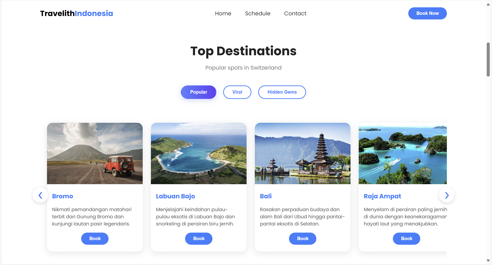
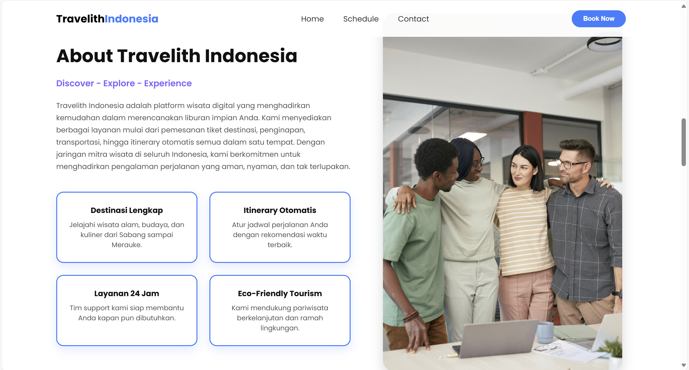
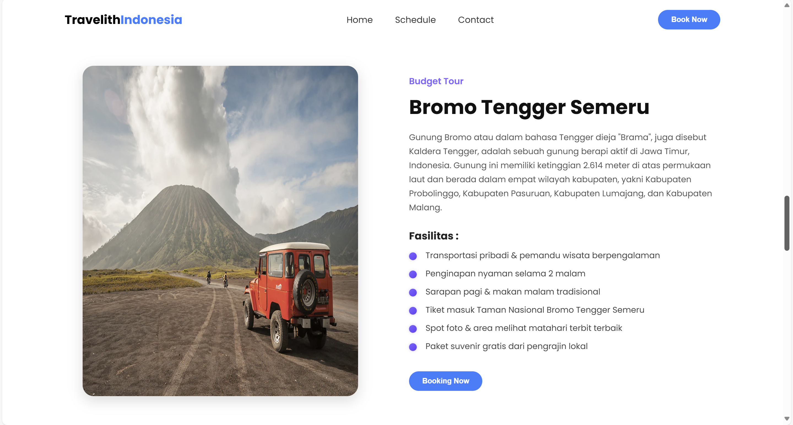
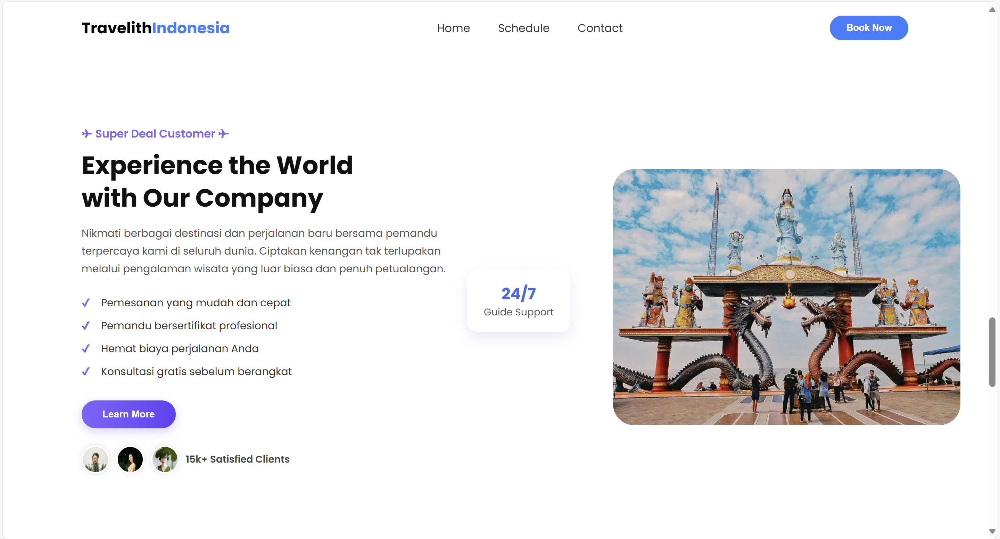
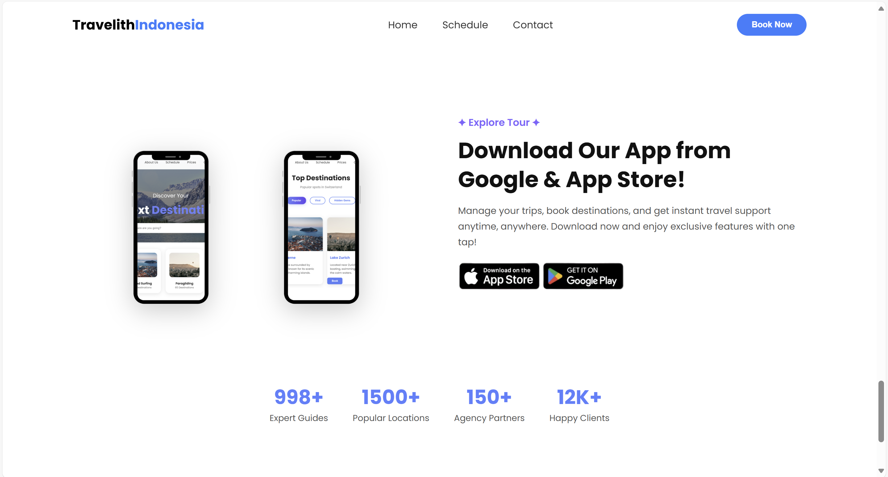
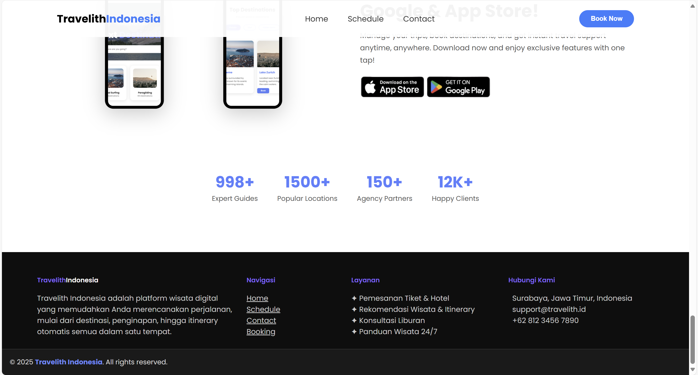
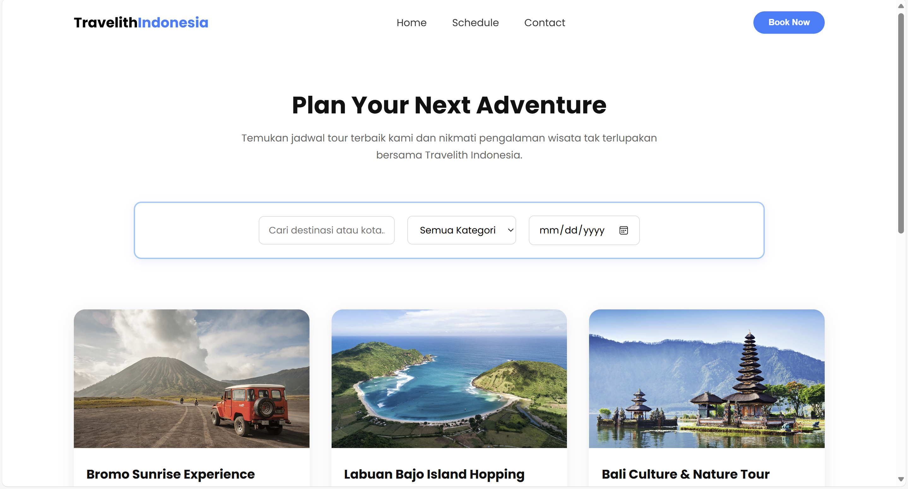
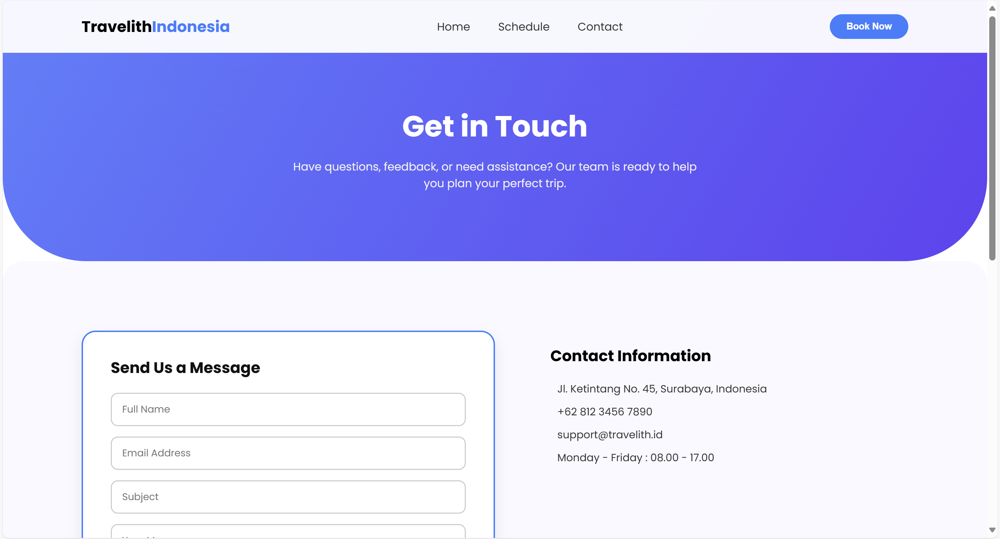
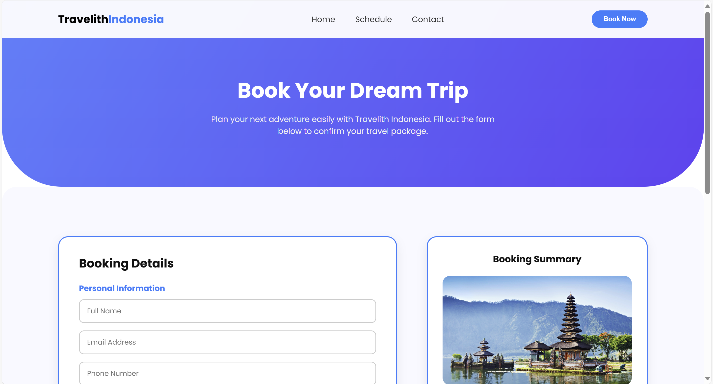

# website-jual-beli-AnggunIsmiN
Website pariwisata interaktif yang menampilkan destinasi wisata, jadwal, dan form pemesanan menggunakan HTML, CSS, dan JavaScript.

## Screenshot Tampilan

  
  

  
  

  
  

  
  

  
  

  

---

## Video

---

## Teknologi yang Digunakan
- HTML5  
- CSS3 (Bootstrap 5)  
- JavaScript  
